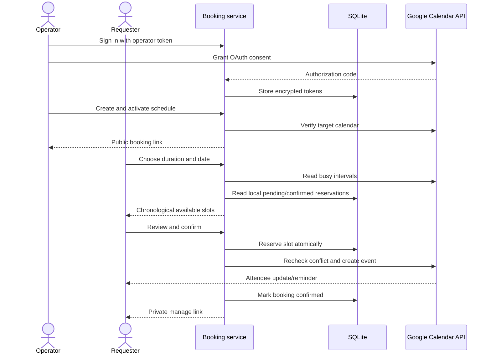
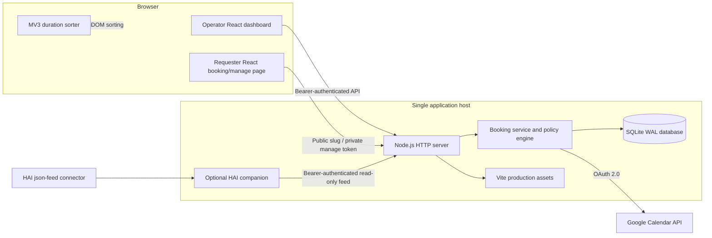

# Chronological Booking

A local-first Google Calendar booking service for creating shareable appointment links, plus a separate Chrome extension that sorts supported appointment choices from shortest to longest duration.

[](https://github.com/Robert-Velhorst/016-Google-Agenda-Chronological-Appointment-booking-link/actions/workflows/ci.yml)

## What this repository is

This repository contains three related components:

1. **Chronological Booking service** — a Node.js, React, and SQLite application that lets one operator create public booking links backed by Google Calendar.
2. **Appointment Duration Sorter** — a Manifest V3 Chrome extension that rearranges recognised appointment choices from shortest to longest duration on supported pages. It does not create, edit, or delete calendar events.
3. **HAI connector companion** — a small read-only proxy that makes the booking feed usable by HAI without putting the connector secret in a URL or HAI's database.

The booking service is not a replacement for all Google Calendar features. It creates ordinary Google Calendar events through the official Calendar API; it does **not** create Google's native Appointment Schedule products.

### In plain language

An operator runs this application on a Windows 11 computer or a single Docker host, connects a Google account, and creates a schedule such as “30- or 60-minute consultations, Monday to Friday, 09:00–17:00.” The application produces a private-looking public URL that can be shared with requesters.

A requester opens that URL, chooses a duration and available time, enters a name and email address, reviews the details, and confirms. The application checks both its own reservations and Google Calendar again before creating the event. It asks Google to send the attendee update and apply the configured email-reminder overrides; actual delivery remains subject to Google account and calendar policy. The requester receives a private management link for rescheduling or cancellation.

The operator token is the dashboard password. There is no username, password-reset email, team account, or role system.

## Current status and honesty boundary

The local application, automated tests, Windows setup path, database migrations, HAI protocol, production build, and CI workflow are implemented. The application deliberately fails closed when Google OAuth, encryption, or provider readiness is missing.

Production readiness still depends on the operator completing environment-specific acceptance:

- create and configure a Google Cloud OAuth client;
- grant consent with the Google account that owns or can edit the target calendar;
- use an exact HTTPS public URL and matching OAuth redirect URI;
- verify a real create, invitation/reminder, reschedule, and cancellation in a disposable calendar;
- verify the chosen ngrok endpoint or reverse proxy is available;
- define a retention policy for requester data;
- keep the deployment to one application instance unless distributed locking and rate limiting are added.

Passing tests do not prove that a particular Google account, ngrok account, email-delivery policy, or Docker daemon is currently operational. See [the final verification report](docs/FINAL_VERIFICATION_REPORT.md) and [acceptance checklist](docs/ACCEPTANCE_TESTS.md) for the latest recorded evidence.

## Contents

- [Capabilities](#capabilities)
- [How booking works](#how-booking-works)
- [Windows 11 quick start](#windows-11-quick-start)
- [Google Calendar setup](#google-calendar-setup)
- [Create and publish the first schedule](#create-and-publish-the-first-schedule)
- [Manual developer setup](#manual-developer-setup)
- [Public access with ngrok](#public-access-with-ngrok)
- [Docker deployment](#docker-deployment)
- [HAI integration](#hai-integration)
- [Chrome extension](#chrome-extension-appointment-duration-sorter)
- [Architecture](#architecture)
- [Configuration reference](#configuration-reference)
- [Commands](#commands)
- [HTTP API](#http-api)
- [Data, security, and privacy](#data-security-and-privacy)
- [Performance and resource use](#performance-and-resource-use)
- [Backup, restore, export, and deletion](#backup-restore-export-and-deletion)
- [Troubleshooting](#troubleshooting)
- [Testing and CI](#testing-and-ci)
- [Project structure](#project-structure)
- [Known limitations](#known-limitations)
- [Further documentation](#further-documentation)

## Capabilities

### Operator dashboard

- Sign in with a strong server-configured bearer token.
- Connect or disconnect one Google Calendar account through OAuth 2.0 with PKCE.
- Create draft schedules with a name, IANA time zone, Google calendar ID, location, durations, and weekday hours.
- Activate a schedule only after the target Google calendar has been verified.
- Pause and reactivate schedules.
- Copy public booking links.
- View weekly availability, bookings, provider state, exceptions, and audit history.
- Stop new slot discovery, booking, and rescheduling through an emergency control; cancellation remains available.
- Reconcile old uncertain bookings by looking up deterministic Google event IDs without creating or deleting events.
- Download a complete JSON export of schedules, bookings, and audit history.
- Delete local product data only after Google has been disconnected and the destructive action has been explicitly confirmed.

The backend supports seven-day availability, multiple non-overlapping windows per day, buffers, minimum notice, booking horizon, slot interval, and reminder settings. The current dashboard creation form intentionally exposes a smaller subset: one Monday–Friday window and the backend defaults for advanced policy fields. Advanced schedules can be created through the authenticated API. There is currently no schedule-editing form.

### Requester booking page

- Responsive desktop and mobile layouts.
- English and Dutch booking copy.
- Multiple appointment durations.
- Calendar date picker constrained by the schedule's weekdays and booking horizon.
- Earliest-first chronological time choices in the schedule's time zone.
- Explicit review and consent before creating an event.
- Live recheck when a slot is confirmed.
- Safe retry behavior based on an idempotency key.
- Private management URL for rescheduling and cancellation.
- Google attendee updates and configured email-reminder overrides, subject to Google policy and delivery.

### Scheduling and consistency controls

- Live Google FreeBusy reads for public slot searches.
- Google event-list conflict checks immediately before create or reschedule.
- Local conflict checks across every schedule that targets the same owner and Google calendar.
- Pending reservations block competing requests while the provider call is in progress.
- Schedule buffers are included in local and provider conflict windows.
- Short SQLite write transactions; Google network calls never run while a database transaction is open.
- Deterministic Google event IDs prevent duplicate events after an ambiguous response or retry.
- ETags protect event updates and deletion from unnoticed external changes.
- Nonexistent and ambiguous daylight-saving wall times are rejected rather than silently shifted.

## How booking works



The authoritative critical-path description is in [docs/CRITICAL_PATH.md](docs/CRITICAL_PATH.md).

## Windows 11 quick start

This is the simplest supported route for a non-technical operator.

### Prerequisites

- Windows 11.
- [Node.js](https://nodejs.org/) 24.15 or newer, including `npm`.
- A modern browser.
- A Google Cloud project and OAuth client for live Calendar operation.
- ngrok only if the service must be reachable from the public internet through an ngrok URL.

### Install

Open PowerShell in the repository folder and run:

```powershell
powershell -ExecutionPolicy Bypass -File .\scripts\setup-windows.ps1
```

The setup script:

- verifies Windows and the Node.js version;
- creates `.env` with random `ADMIN_TOKEN`, `ENCRYPTION_KEY`, and `HAI_CONNECTOR_TOKEN` values only when `.env` does not already exist;
- preserves an existing `.env` unchanged;
- runs a clean dependency installation;
- builds the React frontend;
- applies database migrations;
- runs the environment doctor.

Keep `.env` private. It contains credentials that grant full operator access and decrypt protected local data.

### Start

```powershell
.\start-windows.cmd
```

Open [http://localhost:8787](http://localhost:8787). Open `.env` locally, copy the value after `ADMIN_TOKEN=`, and paste it into the operator sign-in screen. Never send that token by email or place it in a screenshot, issue, URL, or commit.

Without Google OAuth settings, the dashboard and local diagnostics work, but schedule activation and public booking mutations remain unavailable.

## Google Calendar setup

Live booking requires operator-owned Google OAuth configuration. Google Cloud Console labels can change, but the required result is stable:

1. Create or select a Google Cloud project.
2. Enable the **Google Calendar API**.
3. Configure the OAuth consent screen and its permitted/test users.
4. Create an OAuth 2.0 client of type **Web application**.
5. Add the exact redirect URI used by this application:
   - local: `http://localhost:8787/oauth/google/callback`
   - public: `https://YOUR-EXACT-HOST/oauth/google/callback`
6. Add the client values to `.env`:

```dotenv
GOOGLE_CLIENT_ID=your-client-id.apps.googleusercontent.com
GOOGLE_CLIENT_SECRET=your-client-secret
GOOGLE_REDIRECT_URI=http://localhost:8787/oauth/google/callback
```

7. Ensure `BASE_URL` and `GOOGLE_REDIRECT_URI` have the same origin.
8. Restart the service, sign in to the dashboard, and choose **Connect Google Calendar**.
9. Review Google's consent screen and grant access deliberately.

The application requests these scopes:

- `calendar.events` to create, update, and delete booking events;
- `calendar.readonly` to verify calendars and availability.

OAuth access/refresh tokens are encrypted at rest with `ENCRYPTION_KEY`. OAuth state is short-lived, one-time, and protected with PKCE. Google app publishing or verification may be required depending on the account type, audience, and Google's current policies; that is an operator/Google configuration matter rather than an application fallback.

## Create and publish the first schedule

1. Start the service and sign in with `ADMIN_TOKEN`.
2. Connect Google Calendar.
3. Open **Schedules** and create a draft.
4. Use `primary` for the signed-in account's primary calendar, or enter another calendar ID the account can access.
5. Choose an IANA time zone such as `Europe/Amsterdam`.
6. Enter durations as comma-separated whole minutes, for example `30,60`.
7. Activate the draft. Activation performs a real Google calendar verification.
8. Copy the booking link.
9. Before sharing it broadly, make a disposable real booking and verify the event, attendee update, reminders, reschedule, and cancellation in Google Calendar.

Schedule states are:

| State | Meaning |
| --- | --- |
| `draft` | Local configuration only; no public booking page is active. |
| `active` | Public booking is available, subject to Google readiness and emergency stop. |
| `paused` | Public schedule is unavailable until reactivated. |
| `archived` | Retained historical schedule; the current dashboard does not expose an archive button. |

## Manual developer setup

### Requirements

- Node.js 24.15 or newer. CI currently uses Node.js 24.18.1.
- npm and Git.
- No separate database server: the application uses Node's built-in SQLite interface.

### Install and run

```powershell
git clone https://github.com/Robert-Velhorst/016-Google-Agenda-Chronological-Appointment-booking-link.git
cd 016-Google-Agenda-Chronological-Appointment-booking-link
npm ci
Copy-Item .env.example .env
```

Generate private values:

```powershell
node -e "console.log(require('node:crypto').randomBytes(32).toString('hex'))"
```

Use separate generated values for `ADMIN_TOKEN`, `ENCRYPTION_KEY`, and, when enabled, `HAI_CONNECTOR_TOKEN`. `ENCRYPTION_KEY` must be exactly 64 hexadecimal characters. The other two must meet their minimum lengths in the [configuration reference](#configuration-reference).

Then run:

```powershell
npm run build
npm run migrate
npm run doctor
npm start
```

The default development server listens only on `127.0.0.1:8787`. `npm run dev` is a convenience command that builds and starts the server; it is not a hot-module-reload development server.

Database migrations also run automatically whenever the application opens the database. They are versioned and applied once.

## Public access with ngrok

ngrok makes the application on this computer reachable through an HTTPS URL. It is a tunnel, not managed hosting: the computer, application, and ngrok process must remain running.

### Reserved/static endpoint

```powershell
powershell -ExecutionPolicy Bypass -File .\scripts\start-ngrok.ps1 `
  -PublicUrl https://your-reserved-domain.ngrok-free.app
```

### Temporary endpoint

```powershell
powershell -ExecutionPolicy Bypass -File .\scripts\start-ngrok.ps1 -RandomUrl
```

The launcher:

- starts ngrok in the background;
- discovers or validates the HTTPS origin;
- runs the booking service in production mode on loopback;
- aligns `BASE_URL` and `GOOGLE_REDIRECT_URI` with the tunnel;
- enables trusted proxy address handling;
- checks both local and public `/healthz` endpoints;
- prints the public URL only after both checks pass;
- stops its exact server and tunnel child processes when it exits or fails.

Before connecting Google, register the printed redirect URI in the Google OAuth client. A random ngrok URL can change, so it is unsuitable for a stable booking link unless the Google redirect registration and shared links are updated each time.

If ngrok reports `ERR_NGROK_334`, the assigned endpoint is already active elsewhere. Stop the owning endpoint or allocate another endpoint. Do not enable pooling unless deliberate load balancing to identical, shared-state application instances has been designed; this repository is single-instance.

## Docker deployment

The Docker image uses Node.js 24.18.1 Alpine, builds and tests in a build stage, installs only production dependencies in the runtime stage, and runs as the unprivileged `node` user.

Create a production `.env` with at least:

```dotenv
BASE_URL=https://booking.example.com
ADMIN_TOKEN=replace-with-a-strong-random-secret
ENCRYPTION_KEY=replace-with-exactly-64-hexadecimal-characters
GOOGLE_CLIENT_ID=your-client-id.apps.googleusercontent.com
GOOGLE_CLIENT_SECRET=your-client-secret
GOOGLE_REDIRECT_URI=https://booking.example.com/oauth/google/callback
TRUST_PROXY=true
```

Then run:

```powershell
docker compose config
docker compose up -d --build
docker compose ps
```

The Compose service publishes only `127.0.0.1:8787` on the host. Put a correctly configured HTTPS reverse proxy or tunnel in front of it. Set `TRUST_PROXY=true` only when that proxy replaces untrusted forwarding headers and the application is not directly reachable from untrusted clients.

Container limits and hardening in the supplied Compose file:

- one CPU;
- 256 MiB memory;
- 100-process limit;
- read-only root filesystem;
- writable persistent `/app/data` volume;
- all Linux capabilities dropped;
- `no-new-privileges` enabled;
- health check against loopback `/healthz`.

Do not scale the `booking` service above one replica. SQLite transactions and the rate limiter coordinate only within a single application instance.

## HAI integration

The application exposes an owner-scoped, cursor-based, read-only feed. Because HAI's existing `json-feed` connector does not send authorization headers, the companion service injects the bearer token on the private container network.

1. Set the same random value of at least 32 characters as `HAI_CONNECTOR_TOKEN` for both services.
2. Optionally set `HAI_CONNECTOR_PROJECT_KEY` and `HAI_CONNECTOR_MAX_ITEMS`.
3. Leave `HAI_CONNECTOR_INCLUDE_PII=false` unless importing requester names/emails into HAI has been explicitly approved.
4. Start the stack:

```powershell
docker compose -f docker-compose.yml -f integrations/hai/docker-compose.hai.yml up -d --build
```

5. In HAI, configure a `json-feed` connector with this private sync target:

```text
http://hai-connector:8790/feed
```

6. Allowlist the `hai-connector` hostname in HAI and keep both services on the same private Docker network.

The feed supports `cursor` and `limit` query parameters and reports `authority: read_only`. It contains booking status, schedule, timestamps, time zone, and provider status. By default it excludes requester names/emails. It always excludes operator credentials, OAuth tokens, management tokens, token hashes, idempotency keys, and Google ETags. The companion rejects redirects, times out upstream calls, and rejects upstream bodies larger than 2 MiB.

The HAI feed does not grant HAI authority to create, reschedule, cancel, or otherwise mutate bookings. See [integrations/hai/README.md](integrations/hai/README.md).

## Chrome extension: Appointment Duration Sorter

The extension is independent of the booking backend and can be installed without running the Node.js service.

### Install unpacked

1. Open `chrome://extensions` in Chrome.
2. Enable **Developer mode**.
3. Select **Load unpacked**.
4. Select this repository folder.

### What it does

- Runs on declared `noodzakelijkonline.nl`, Google Calendar appointment/self-scheduling, and `calendar.app.google` routes.
- Recognises duration values in attributes and human-readable labels, including combined hours and minutes.
- Sorts recognised sibling appointment choices from shortest to longest.
- Re-sorts after supported live DOM text or duration-attribute changes.
- Runs in embedded frames covered by the declared host permissions.
- Leaves unrelated page sections and Google's ordinary week/day/month event grid alone.
- Does not send data to this backend or any analytics service.
- Does not create, edit, or delete Google Calendar events.

`test-page.html` is a manual visual fixture. The repeatable content-script regression checks run as part of `npm test`.

## Architecture



### Major boundaries

| Component | Responsibility |
| --- | --- |
| `frontend/` | React operator and requester interfaces. |
| `src/app.js` | HTTP routing, authentication boundaries, security headers, rate limiting, JSON/static responses. |
| `src/booking-service.js` | Schedule/booking state transitions, conflicts, reconciliation, export, HAI feed. |
| `src/policy.js` | Schedule validation, time-zone-aware slot generation, DST handling. |
| `src/google-provider.js` | OAuth, token refresh, FreeBusy, event create/read/update/delete. |
| `src/db.js` and `migrations/` | SQLite lifecycle, WAL mode, migrations, transactions, audit entries. |
| `integrations/hai/` | Optional read-only HAI feed proxy. |
| `content.js` and `manifest.json` | Independent Chrome duration-sorting extension. |

### Stored data

| Table | Purpose |
| --- | --- |
| `owners` | The configured single owner identity. |
| `oauth_connections` | Encrypted Google OAuth token set and connection state. |
| `oauth_states` | Short-lived one-time OAuth state and PKCE verifier. |
| `schedules` | Policy, calendar target, public slug, and lifecycle state. |
| `bookings` | Requester details, reserved/confirmed time, Google identifiers, encrypted management recovery token. |
| `audit_logs` | Append-only operational action history. |
| `app_settings` | Global emergency-stop state. |
| `schema_migrations` | Applied migration versions. |

SQLite runs with foreign keys, WAL journaling, and a five-second busy timeout. Versioned indexes cover schedule/calendar and booking conflict/cursor lookups.

## Configuration reference

All configuration comes from environment variables; local runs load `.env` through `dotenv`.

| Variable | Default | Requirement and effect |
| --- | --- | --- |
| `APP_ENV` | `development` | Use `production` behind the public HTTPS deployment. Production enables stricter configuration checks. |
| `HOST` | `127.0.0.1` in development; `0.0.0.0` in production | Listening interface. The ngrok launcher overrides this to loopback. |
| `PORT` | `8787` | Integer from 1 through 65535. |
| `BASE_URL` | `http://localhost:8787` | Public origin only: HTTP(S), no credentials/path/query/fragment. HTTPS is mandatory in production. |
| `DATABASE_PATH` | `./data/booking.sqlite` | SQLite file path, resolved to an absolute path. Parent folders are created automatically. |
| `OWNER_ID` | `owner-local` | Stable single-owner database identifier. Changing it creates a different logical owner boundary. |
| `OWNER_EMAIL` | `owner@example.com` | Owner metadata stored locally. |
| `ADMIN_TOKEN` | none | Required; at least 24 characters. Grants full operator API access. |
| `ENCRYPTION_KEY` | none | Exactly 64 hexadecimal characters whenever Google is configured or `APP_ENV=production`. Encrypts OAuth and recoverable manage tokens. |
| `GOOGLE_CLIENT_ID` | empty | OAuth web-client ID. ID and secret must be configured together. |
| `GOOGLE_CLIENT_SECRET` | empty | OAuth web-client secret. Never expose it to the browser or commit it. |
| `GOOGLE_REDIRECT_URI` | `${BASE_URL}/oauth/google/callback` | Must have the same origin as `BASE_URL` when Google is configured. |
| `TRUST_PROXY` | `false` | When exactly `true`, uses the first `X-Forwarded-For` value for rate-limit identity. Enable only behind a trusted sanitising proxy. |
| `RATE_LIMIT_WINDOW_MS` | `60000` | Rate-limit window; integer of at least 1000 ms. |
| `RATE_LIMIT_PUBLIC` | `60` | Public requests allowed per IP/window in direct local configuration. Compose defaults to 120. |
| `RATE_LIMIT_ADMIN` | `120` | Admin requests allowed per IP/window in direct local configuration. Compose defaults to 300. |
| `PROVIDER_TIMEOUT_MS` | `10000` | Google/HAI upstream timeout; integer of at least 1000 ms. |
| `RECONCILE_MIN_AGE_MS` | `60000` | Pending reservation age before operator reconciliation. In production it must be at least twice `PROVIDER_TIMEOUT_MS`. |
| `HAI_CONNECTOR_TOKEN` | empty | Enables HAI endpoints when set; at least 32 characters. |
| `HAI_CONNECTOR_PROJECT_KEY` | `016-Google-Agenda` | HAI project label, trimmed to at most 120 characters and never empty. |
| `HAI_CONNECTOR_MAX_ITEMS` | `100` | Maximum feed page size from 1 through 500. |
| `HAI_CONNECTOR_INCLUDE_PII` | `false` | When exactly `true`, includes requester name/email in the HAI feed. Requires an explicit privacy decision. |

Boolean values are strict: use `true` or `false`, not `1`, `yes`, or arbitrary text.

## Commands

| Command | Purpose |
| --- | --- |
| `npm ci` | Install exactly the lockfile dependencies. |
| `npm run build` | Build the production React assets into ignored `dist/`. |
| `npm run start` or `npm start` | Start the Node.js server using the current environment. |
| `npm run dev` | Build once, then start; no live-reload server. |
| `npm run migrate` | Open the database, apply pending migrations, and print their versions. |
| `npm run doctor` | Check configuration, Node version, frontend build, encryption, Google configuration, and database. |
| `npm run check` | Syntax-check JavaScript and validate the extension manifest/icons. |
| `npm test` | Run backend/API/provider/policy/rate-limit tests and the extension content-script suite. |
| `npm run backup -- <path>` | Create a consistent SQLite backup with `VACUUM INTO`; refuses to overwrite. |
| `npm run support:bundle` | Write a redacted local diagnostic JSON file next to the database. |
| `npm run hai:connector` | Run the HAI proxy directly; requires its environment variables. |

## HTTP API

The React interfaces use the same API. Error responses use a consistent shape containing `error.code`, `error.message`, `error.retryable`, and a server-generated `requestId`.

### Public and requester routes

| Method | Route | Purpose |
| --- | --- | --- |
| `GET` | `/healthz` | Process liveness; returns `ok` without testing Google. |
| `GET` | `/readyz` | Returns 200 only when Google is connected and emergency stop is off. |
| `GET` | `/oauth/google/callback` | One-time Google OAuth redirect target. |
| `GET` | `/api/public/schedules/:slug` | Public presentation fields for one active schedule. |
| `GET` | `/api/public/schedules/:slug/slots` | Chronological slots for `duration`, `from`, and `to`; date span is limited to 31 days. |
| `POST` | `/api/public/schedules/:slug/book` | Confirm booking; requires an `Idempotency-Key` header of 16–200 characters. |
| `POST` | `/api/public/bookings/:id/manage` | Read a booking with its private manage token in the JSON body. |
| `POST` | `/api/public/bookings/:id/reschedule` | Recheck and move a confirmed booking. |
| `POST` | `/api/public/bookings/:id/cancel` | Cancel and remove the Google event; an already-missing event is handled safely. |

### Operator routes

All `/api/admin/*` routes require `Authorization: Bearer <ADMIN_TOKEN>`.

| Method | Route | Purpose |
| --- | --- | --- |
| `GET` | `/api/admin/status` | Application, emergency-stop, Google, HAI, database, and public URL state. |
| `GET` / `POST` | `/api/admin/schedules` | List or create schedules. |
| `PATCH` | `/api/admin/schedules/:id/status` | Activate, pause, or archive an owner-scoped schedule. |
| `GET` | `/api/admin/bookings` | Most recent 500 booking rows for the dashboard, without management secrets. |
| `GET` | `/api/admin/audit` | Most recent 500 audit rows. |
| `POST` | `/api/admin/google/start` | Create the Google OAuth authorization URL. |
| `POST` | `/api/admin/google/disconnect` | Revoke access best-effort and mark the local connection revoked. |
| `POST` | `/api/admin/emergency-stop` | Stop or resume public mutation flows. |
| `POST` | `/api/admin/reconcile` | Check up to 25 old pending reservations against Google. |
| `GET` | `/api/admin/export` | Download the complete redacted local JSON export; not limited to 500 rows. |
| `DELETE` | `/api/admin/data` | Delete local owner data after exact confirmation and prior Google disconnect. |

### HAI routes

These require `Authorization: Bearer <HAI_CONNECTOR_TOKEN>` and are intended for the private companion, not a public browser client.

| Method | Route | Purpose |
| --- | --- | --- |
| `GET` | `/api/integrations/hai/status` | Feed schema, read-only authority, and PII-mode status. |
| `GET` | `/api/integrations/hai/feed` | Cursor-based read-only booking feed. |

See [docs/API_USAGE_AUDIT.md](docs/API_USAGE_AUDIT.md) for the authority/effect audit.

### Key request bodies

Create a schedule with `POST /api/admin/schedules`:

```json
{
  "name": "Consultation",
  "timezone": "Europe/Amsterdam",
  "calendarId": "primary",
  "location": "Google Meet",
  "durations": [30, 60],
  "weeklyAvailability": {
    "1": [["09:00", "12:00"], ["13:00", "17:00"]],
    "2": [["09:00", "17:00"]]
  },
  "slotIntervalMinutes": 15,
  "bufferBeforeMinutes": 10,
  "bufferAfterMinutes": 10,
  "minNoticeMinutes": 120,
  "maxAdvanceDays": 60,
  "reminderMinutes": [1440]
}
```

Weekday keys use ISO numbering: `1` is Monday and `7` is Sunday. Durations are normalised to unique whole-minute values from 5 through 1440. Availability windows must use valid `HH:MM` values, cannot overlap on one day, and cannot cross midnight. Reminder offsets are whole minutes from 0 through 40320; Google receives at most the first five after validation/sorting.

Other mutation bodies:

| Route | JSON body |
| --- | --- |
| `PATCH /api/admin/schedules/:id/status` | `{ "status": "active" }`, `paused`, or `archived` |
| `POST /api/admin/emergency-stop` | `{ "enabled": true }` or `false` |
| `POST /api/public/schedules/:slug/book` | `{ "name": "Ada", "email": "ada@example.com", "duration": 30, "start": "2026-08-24T08:00:00Z" }` plus `Idempotency-Key` header |
| `POST /api/public/bookings/:id/manage` | `{ "token": "private-management-token" }` |
| `POST /api/public/bookings/:id/reschedule` | `{ "token": "private-management-token", "start": "2026-08-25T08:00:00Z" }` |
| `POST /api/public/bookings/:id/cancel` | `{ "token": "private-management-token" }` |
| `DELETE /api/admin/data` | `{ "confirmation": "DELETE LOCAL DATA", "acknowledgeGoogleEventsRemain": true }` |

Times sent to booking/reschedule endpoints are ISO 8601 instants. The server re-derives and validates the slot against the schedule policy; clients cannot bypass availability by posting an arbitrary timestamp.

## Data, security, and privacy

### Authentication and access

- The service is deliberately single-owner.
- The operator token is compared in constant time and stored by the dashboard only in browser `sessionStorage`.
- Operator authentication is bearer-token based, not cookie based.
- Public schedule links contain a human-readable stem plus a random 96-bit suffix. They are unlisted, not authenticated.
- Booking management requires a separate random 256-bit token placed in the URL fragment. Fragments are not sent in HTTP request URLs; the frontend submits the token in the request body.

### Encryption and secret handling

- OAuth token sets and recoverable management tokens are encrypted with AES-256-GCM.
- Management-token verification uses a SHA-256 hash.
- `.env`, databases, backups, support bundles, build output, and runtime data are ignored by Git.
- Never rotate `ENCRYPTION_KEY` while encrypted records still need to be read. Disconnect Google and follow a deliberate migration/deletion procedure first.

### Web and provider safety

- Content Security Policy, HSTS on HTTPS, `X-Content-Type-Options`, `X-Frame-Options`, no-referrer policy, and restrictive permissions policy.
- Same-origin frontend/API design and no cookie-authenticated CSRF surface.
- Request bodies capped at 64 KiB.
- Static path containment and immutable caching for hashed assets.
- Bounded in-memory rate limiter with standard rate-limit response headers.
- Google request timeouts, bounded pagination, narrow response fields, and deduplicated token refresh.
- Provider test fake exists only under `test/`; production has no fake-success fallback.

### Personal data

SQLite stores requester name, email, appointment timestamps, schedule, provider state, and audit metadata. Google receives the attendee name/email and event details. The operator export includes requester data but removes management secrets, token hashes, idempotency keys, and ETags. Support bundles exclude requester identities and secrets.

HAI excludes requester name/email unless explicitly enabled. This repository does not include an automated retention worker. The operator must choose and execute a lawful retention/backup deletion policy appropriate to their jurisdiction and use case.

Read [docs/SECURITY.md](docs/SECURITY.md) before exposing the service publicly.

## Performance and resource use

The application is deliberately small and single-process:

- React is compiled to static assets; React is not installed in the production container.
- Static files are cached in memory after first read.
- Compressible assets of at least 1 KiB are pre-gzipped in memory with the fastest gzip level.
- Hashed assets receive one-year immutable browser caching; `index.html` is not cached.
- SQLite uses WAL, targeted indexes, foreign keys, and short synchronous transactions.
- Google calls occur outside database transactions.
- Google event queries request narrow fields, paginate in large pages, and fail closed after a bounded number of pages.
- OAuth refreshes are deduplicated per owner.
- Public slot searches are capped at 31 days and the schedule horizon is capped at 730 days.
- Admin display queries are capped at 500 rows; export deliberately returns all owner rows.
- HAI pages and upstream response size are bounded.
- The in-memory rate-limit map is bounded; it is not a distributed rate limiter.
- There are no application background workers. Google owns email reminders.

These choices optimise a single-owner installation. They are not evidence that horizontal multi-instance deployment is safe.

## Backup, restore, export, and deletion

### SQLite backup

Stop writes where practical, then run:

```powershell
npm run backup -- .\backups\booking-2026-08-20.sqlite
```

The command uses SQLite `VACUUM INTO` and refuses to overwrite an existing target.

For Docker, put the backup inside the writable data volume:

```powershell
docker compose exec booking node scripts/backup.js /app/data/backups/booking.sqlite
```

Copy backups to encrypted storage and test restoration. Backups contain requester data and encrypted tokens; encryption at the application-field level does not make the entire database non-sensitive.

### Restore

1. Stop the application.
2. Preserve the current database and its WAL/SHM state as a recoverable set.
3. Validate the candidate backup with SQLite `PRAGMA integrity_check`.
4. Place the validated file at `DATABASE_PATH`.
5. Run `npm run migrate` and `npm run doctor`.
6. Start one instance and perform health/readiness plus a low-risk booking check.

The detailed command is in [docs/OPERATOR_RUNBOOK.md](docs/OPERATOR_RUNBOOK.md).

### Export

The dashboard's **Export local data** action downloads a complete JSON export for the owner. It is for portability/review, not a restore/import mechanism. No import workflow is implemented.

### Local deletion

The dashboard requires all of the following:

- disconnect Google first so the application can attempt token revocation;
- type `DELETE LOCAL DATA` exactly;
- acknowledge that existing Google events remain.

Local deletion removes local bookings, schedules, OAuth rows, OAuth states, and prior audit rows, then records a local-deletion audit entry. It does not delete existing Google Calendar events.

## Troubleshooting

### The server will not start

- Run `node --version`; it must be 24.15 or newer.
- Run `npm ci`, `npm run build`, `npm run migrate`, and `npm run doctor`.
- Confirm `.env` exists and `ADMIN_TOKEN` has at least 24 characters.
- In production, confirm `BASE_URL` uses HTTPS and `ENCRYPTION_KEY` is exactly 64 hexadecimal characters.
- If port 8787 is already in use, stop the known owning process or deliberately configure another `PORT` and matching `BASE_URL`.

### The dashboard opens but Google is unavailable

- `not_configured`: add both Google client values and restart.
- `not_connected`: choose **Connect Google Calendar** and complete consent.
- `invalid` or reauthorization error: reconnect Google.
- Confirm the redirect URI exactly matches both Google Cloud and the application's origin.
- Use `/readyz` to distinguish a live process from provider-ready booking service.

### A booking is uncertain

Do not create a second manual event. Retry the same browser attempt so its idempotency key is reused. For an old pending record, the operator can choose **Reconcile uncertain bookings**. Reconciliation only looks up the deterministic event ID: a found event becomes confirmed, a definitive 404 releases the reservation as failed, and transient provider errors remain unresolved.

### ngrok fails

- Run `ngrok version` and `ngrok config check`.
- Confirm the URL is an HTTPS origin with no path/query/fragment.
- `ERR_NGROK_334` means the endpoint is already active elsewhere.
- Confirm the exact ngrok URL is registered as the Google OAuth redirect before connecting Google.
- The launcher reports success only after local and public health checks pass.

### Docker is unhealthy

- Run `docker compose config` before starting.
- Check `docker compose ps` and `docker compose logs booking`.
- Confirm the Docker daemon is responsive and `BASE_URL`, `ADMIN_TOKEN`, and `ENCRYPTION_KEY` are present.
- Do not restart Docker Desktop blindly when it hosts unrelated workloads.

### Frontend assets are unavailable

Run `npm run build`. The Node server returns `FRONTEND_NOT_BUILT` when `dist/index.html` is missing.

### Support information

Run:

```powershell
npm run support:bundle
```

Review the generated JSON before sharing. It contains runtime/configuration flags, migration versions, counts, and recent action names; it excludes requester identities and tokens.

## Testing and CI

Run the complete local verification set:

```powershell
npm ci
npm run check
npm test
npm run build
npm audit --audit-level=high
docker compose config
```

Coverage includes:

- schedule validation and chronological slot generation;
- Europe/Amsterdam DST gap and fold behavior;
- idempotency, local concurrency, buffers, and cross-schedule conflicts;
- provider failures, ambiguity recovery, reconciliation, OAuth refresh, timeouts, and pagination;
- rescheduling, ETags, cancellation, emergency stop, export redaction, and deletion safety;
- API authentication, security headers, malformed requests, and HAI feed boundaries;
- bounded rate-limit memory;
- extension duration parsing and live DOM updates.

GitHub Actions runs on every push and pull request with Node.js 24.18.1 and executes clean install, syntax/asset checks, tests, production build, and a high-severity dependency audit.

Automated tests use a controlled calendar provider. They do not replace the live Google acceptance script in [docs/ACCEPTANCE_TESTS.md](docs/ACCEPTANCE_TESTS.md). The repository currently has no committed component-browser or full real-provider E2E suite.

## Project structure

```text
.
├── frontend/                 React operator and requester interfaces
├── icons/                    Chrome extension icons
├── integrations/hai/        Read-only HAI companion and Compose overlay
├── migrations/              Ordered SQLite schema migrations
├── scripts/                 Setup, doctor, migration, backup, ngrok, support tools
├── src/                     Node server, service, policy, database, provider, security
├── test/                    Node test suites and fake provider
├── content.js               Chrome extension content script
├── manifest.json            Manifest V3 extension definition
├── docker-compose.yml       Hardened single-instance container deployment
├── Dockerfile               Multi-stage application image
├── start-windows.cmd        Windows launcher
├── test-content.js          Extension regression suite
└── vite.config.mjs          React production build configuration
```

Generated/runtime paths such as `node_modules/`, `dist/`, `data/`, `backups/`, support bundles, `.env`, and SQLite files are ignored by Git.

## Known limitations

- Single owner only; no teams, roles, accounts, password recovery, or SSO.
- Single application instance only; no distributed locking or shared rate limiter.
- SQLite only; no PostgreSQL/MySQL adapter.
- The dashboard can create a simple Monday–Friday window but cannot edit every backend policy field or edit an existing schedule.
- Dashboard booking/audit displays are capped at 500 rows and have no search or pagination UI; export is complete.
- No automated requester-data retention or archival worker.
- No JSON import/restore workflow through the UI.
- No application-owned email service, SMS, payments, billing, analytics, AI decision-making, file uploads, or background job queue.
- Reminder and attendee email delivery depend on Google Calendar and account policy.
- No creation of Google Appointment Schedule products—only ordinary events.
- No committed full browser E2E suite and no automated live Google account tests.
- ngrok availability, Google consent, domain ownership, and public delivery must be accepted in the operator's environment.
- The Chrome extension is loaded unpacked; it is not packaged or published in the Chrome Web Store by this repository.

## Further documentation

| Document | Audience and purpose |
| --- | --- |
| [Critical path](docs/CRITICAL_PATH.md) | Exact create-to-cancel sequence and invariants. |
| [Operator runbook](docs/OPERATOR_RUNBOOK.md) | Incidents, backup/restore, release, and support procedures. |
| [Security and privacy](docs/SECURITY.md) | Authentication, secrets, threat model, and personal-data boundary. |
| [Acceptance tests](docs/ACCEPTANCE_TESTS.md) | Automated evidence and external live-provider gates. |
| [Final verification report](docs/FINAL_VERIFICATION_REPORT.md) | Latest recorded verification results and explicit blockers. |
| [API usage audit](docs/API_USAGE_AUDIT.md) | Route callers, authentication, and external effects. |
| [UI action audit](docs/UI_ACTION_AUDIT.md) | Dashboard/requester actions and failure behavior. |
| [Technical audit](docs/TECHNICAL_AUDIT.md) | Architecture and implementation history. |
| [Goal completion matrix](docs/GOAL_COMPLETION_MATRIX.md) | Detailed implemented/partial/blocked scope accounting. |
| [HAI connector guide](integrations/hai/README.md) | Private read-only HAI integration. |
| [Changelog](CHANGELOG.md) | Version-level changes. |

## Contributing and licensing

Use a feature branch, keep production fakes out of runtime code, add regression coverage for behavior changes, and run the full verification set before opening a pull request. Never commit `.env`, OAuth credentials, operator/HAI tokens, requester data, SQLite files, backups, or support bundles.

This repository currently does **not** contain an open-source `LICENSE` file. Do not assume permission to copy, redistribute, or commercially reuse the code; obtain permission from the repository owner first.
